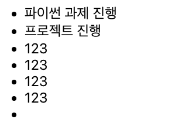

# ToDo MiniProject

---

## ToDo App 실행 방법

### 실행 방법

`yarn start`를 통해 프로젝트를 시작할 수 있습니다.

### ToDo 방문하기

아래의 링크에서 실제 작동되는 App을 확인할 수 있습니다.

링크 추가하기! (netlify)

---

### Commit Message Convention

`feat`: 기능 추가, 삭제, 변경

`fix`: 버그 수정

`docs`: 문서 추가, 삭제, 변경 - 코드 수정없음

`style`: 코드 형식, 정렬, 주석 등의 변경
(세미콜론 추가 같은 코드 수정이 있으나, 기능에 변동 X)

`refactor`: 코드 리펙토링 (변수명, JS -> TS)

`test`: 테스트 코드 추가, 삭제, 변경 등

`chore`: 위에 해당하지 않는 모든 변경, eg. 빌드 스크립트 수정, 패키지 배포 설정 변경

---

### ToDo 핵심 기능

- [ ] 아이템 추가 기능
  - [ ] 컴포넌트 분리, `ToDo 컴포넌트`는 todos 데이터만 보이게, `AddToDo 컴포넌트`는 사용자 입력을 받아 그 값을 전달하는 기능 담당.
  - [ ] input validation 필요
- [ ] 아이템 삭제 기능
  - [ ] 삭제시 `정말 삭제하시겠습니까?` 경고 기능 구현!
- [ ] 아이템 체크 박스 구현
  - [ ] Active / Completed / All 각 상황에 맞게 필터링 구현!
- [ ] `useContext` 활용 DarkMode 구현!
- [ ] `localstorage` 저장 기능 구현!
- [ ] 깔끔하게 스타일링!
- [ ] `netlify` 활용 배포!

... 생각나면 더 추가하기!

---

### ToDo 기능 실행 영상!

---

### Trouble Shooting 🛠️

`ToDo Project` 진행 중 막혔던 부분을 정리하고 해결과정을 정리해보자.

1.  `AddToDo` 기능 구현시 input의 value가 없을 떄 추가되지 못하도록 구현 중 발생한 에러!

    - 처음에는 `if(text.length === 0)` 일때 추가를 못하도록 구현을 했지만, 이 경우 공백을 `' '` 이렇게 스페이스바만 눌렀을 경우, 문자열이 있다고 인식하여 아래 이미지와 같이 조건문을 무시하고 공백으로 추가가 된다.
      
      `trim`을 활용해서 앞/뒤의 여백을 없앤 후, 길이를 다시 측정하여 문제를 해결하였다. `if(text.trim() === '')` or `if(text.trim().length === 0)` 을 통해 해결했다.
