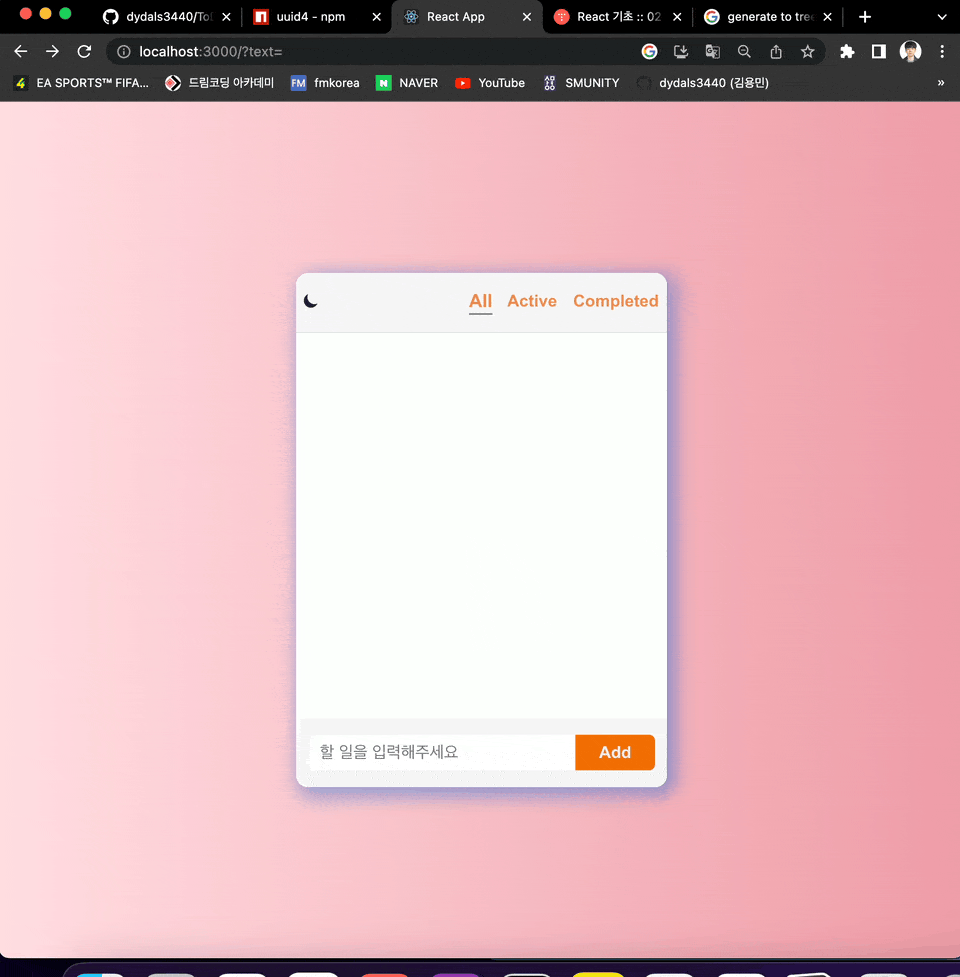

# ToDo MiniProject

---

## ToDo App 실행 방법

### 실행 방법

`yarn start`를 통해 프로젝트를 시작할 수 있습니다.

### ToDo 사용해보기

아래의 링크에서 실제 작동되는 App을 확인할 수 있습니다.

[🏃‍♂️ ToDo 사용해보기](https://matthew--roaring-kelpie-519f5d.netlify.app/)

---

# 프로젝트 파일 구조

```js
📦src
 ┣ 📂components
 ┃ ┣ 📂AddToDo
 ┃ ┃ ┣ 📜AddToDo.jsx
 ┃ ┃ ┗ 📜AddToDo.module.css
 ┃ ┣ 📂Header
 ┃ ┃ ┣ 📜Header.jsx
 ┃ ┃ ┗ 📜Header.module.css
 ┃ ┣ 📂ToDo
 ┃ ┃ ┣ 📜ToDo.jsx
 ┃ ┃ ┗ 📜ToDo.module.css
 ┃ ┗ 📂ToDoList
 ┃ ┃ ┣ 📜TodoList.jsx
 ┃ ┃ ┗ 📜TodoList.module.css
 ┣ 📂context
 ┃ ┗ 📜DarkModeContext.js
 ┣ 📂imgs
 ┃ ┗ 📜usingApp.gif
 ┣ 📜App.css
 ┣ 📜App.js
 ┣ 📜App.test.js
 ┣ 📜index.css
 ┣ 📜index.js
 ┣ 📜logo.svg
 ┣ 📜reportWebVitals.js
 ┗ 📜setupTests.js
```

---

### Commit Message Convention

`feat`: 기능 추가, 삭제, 변경

`fix`: 버그 수정

`docs`: 문서 추가, 삭제, 변경 - 코드 수정없음

`style`: 코드 형식, 정렬, 주석 등의 변경
(세미콜론 추가 같은 코드 수정이 있으나, 기능에 변동 X)

`refactor`: 코드 리펙토링 (변수명, JS -> TS)

`test`: 테스트 코드 추가, 삭제, 변경 등

`chore`: 위에 해당하지 않는 모든 변경, eg. 빌드 스크립트 수정, 패키지 배포 설정 변경

---

### ToDo 핵심 기능

- [x] 아이템 추가 기능
  - [x] 컴포넌트 분리, `ToDo 컴포넌트`는 todos 데이터만 보이게, `AddToDo 컴포넌트`는 사용자 입력을 받아 그 값을 전달하는 기능 담당.
  - [x] input validation 필요
- [x] 아이템 삭제 기능
  - [x] 삭제시 `정말 삭제하시겠습니까?` 경고 기능 구현!
- [x] 아이템 체크 박스 구현
  - [x] Active / Completed / All 각 상황에 맞게 필터링 구현!
- [x] `useContext` 활용 DarkMode 구현!
- [x] `localstorage` 저장 기능 구현!
- [x] 깔끔하게 스타일링!
- [x] `netlify` 활용 배포!

---

### ToDo 기능 실행 영상!



---

### Trouble Shooting 🛠️

ToDo프로젝트를 진행하면서 발생한 `버그 수정`, `문제 해결`, 기능 구현시 `어려웠던 점 정리`, `성능 개선`, `작업 효율 향상` 들에 관해 정리한 기록입니다.

[프로젝트를 진행시 배운점들 정리](https://www.notion.so/ToDo-Project-fb96d25ffef1446c8708c5bd762a5837?pvs=4)

---

### 버그 발생시 ☎️

연락 부탁드립니다. <dydals3440@gmail.com>
